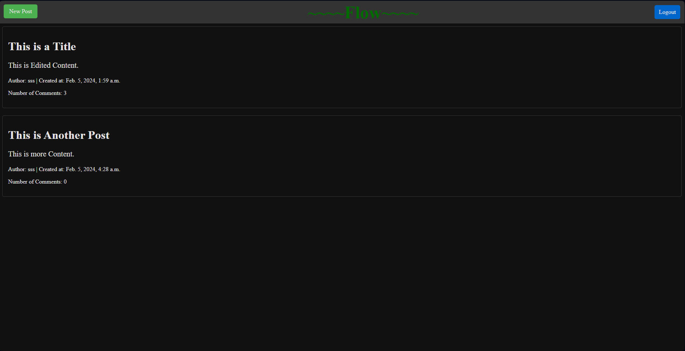
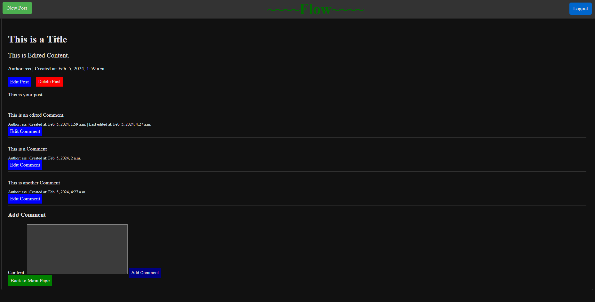
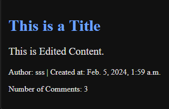
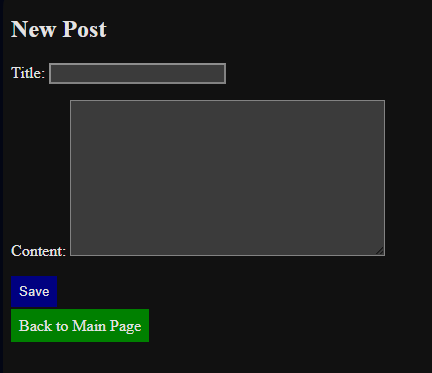
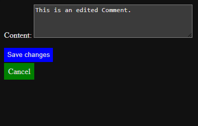
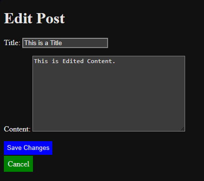
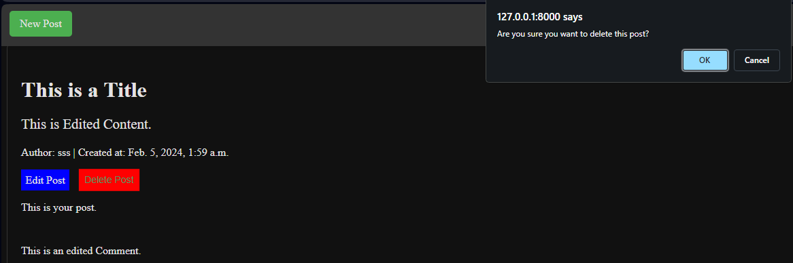
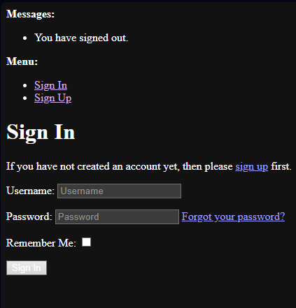
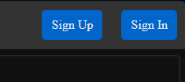

# The Flow - Social Blogging Platform

Welcome to **Flow**, a social blogging platform that lets you express yourself through posts and engage with other users.

## Features

### Blogging Environment

The platform offers a user-friendly environment for creating and exploring blog content. Here's an overview of the key features:

- Navbar with easy access to key actions like creating a new post, signing in, or signing up.
- Post list showcasing titles, content snippets, and post details.
- Post details page revealing the full content, author information, creation time, and the number of comments.
- User authentication for personalized experiences.
- Options for logging in, signing up, or logging out based on user status.
- Responsive design for optimal viewing across devices.

### Post Interaction

- Users can create new posts seamlessly through a dedicated "New Post" button.
- Comment section for each post, allowing users to engage in discussions.
- Number of comments displayed for each post on the main page.
- User-specific actions like logging out or accessing account-related pages.

- The interactive and visually appealing design enhances the overall user experience.

## Styling

### Color Palette

To maintain a vibrant and engaging theme, The Flow embraces a diverse color palette:

- The background, a blend of deep teal, signifies the dynamic and ever-flowing nature of social interactions.
- Post content presented in calming light blue, fostering a sense of open communication and sharing.
- Key action buttons, such as "New Post," are highlighted in a refreshing shade of green, promoting user engagement.

## How to Use

1. **Explore Posts:**
   - Navigate through the main page to discover a curated list of posts.

2. **Create a New Post:**
   - Click on the "New Post" button in the navbar to share your thoughts and stories.
   

3. **Engage in Discussions:**
   - Access post details to read full content, view comments, and participate in discussions.
   

4. **Edit your comments as well as your posts.**

   
   

5. **Or even delete your posts.**

   

6. **Authentication:**
   - Log in or sign up to unlock personalized features and connect with the community.
   
   

7. **Optimized Experience:**
   - Enjoy a visually appealing and responsive design for an optimal browsing experience.

## Technologies Used

- **Django/Python:** Powering the backend and handling data models.
- **HTML, CSS, JavaScript:** Crafting the frontend and enhancing user interactions.

## Testing

- Tested deleting functionality on the post detail page.
- Tested editing functionality on the post detail page.
- Tested adding comments functionality on the post detail page.
- Tested editing comments functionality on the post detail page.
- Tested the functionality of the navbar.
- Tested the functionality of the post list page.
- Tested the functionality of the post detail page.
- Tested the functionality of the user authentication.
- Tested the functionality of the user profile page.
- Tested the functionality of the new post page.
- Tested the functionality of the login page.
- Tested the functionality of "Back to main page" button/s.
- Tested the functionality of the 404 page.

## Deployment

- Flow is deployed on Heroku under <https://flow-203e46bb486c.herokuapp.com/>.

1. Go to your Heroku Dashboard.
2. Click on the "New" button.
3. Select "Create new app".
4. Enter a unique name for your app.
5. Click on "Create app".
6. Click on the "Deploy" tab.
7. Click on "GitHub" and sign in with your GitHub account.
8. Select your repository.
9. Click on "Enable Automatic Deploys".
10. Click on "Deploy Branch".
11. Click on "View".
12. Click on "Open App".
13. You're all set!
